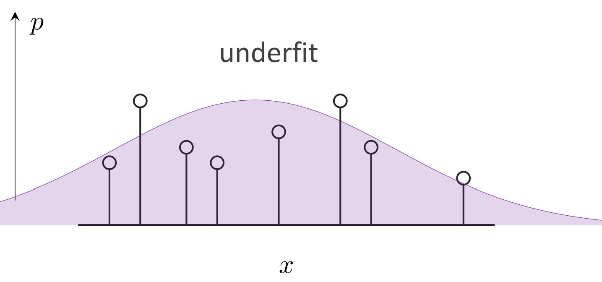
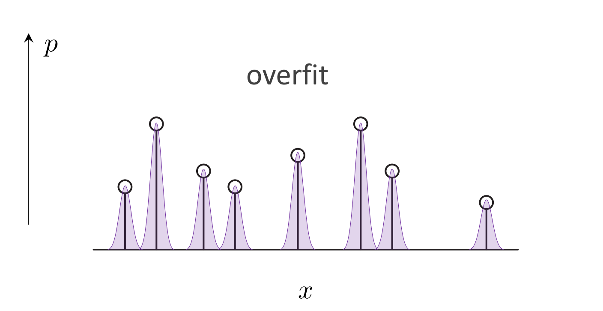

相关资源：https://mit-6s978.github.io/schedule.html

MIT 何凯明的课，打算自学一下，这个部分主要是一个引言部分。引言部分从数学角度出发的。

### 什么样子的场景适合被建模成 generative model
主要包含以下几个共同特征：
- 对于1个输入，可能有多个或者无穷多个输出。
- 某几种预测似乎会更合理：我的理解是预测结果应该具有多元性。
- 训练数据不像传统分类任务一样具有确定的标签/没有确定解。
    相比之下，discriminative model对于一个sample $x$（比如一个人的图），应该输出1个label $y$（person）；但是generative model对于一个label $y$（比如"dog"），应该输出至少一个sample $x$（比如多个狗的图片）。
- 预测的结果会比输入更加高维度/包含信息更多/更复杂。

我们再从贝叶斯公式的角度来看这个问题。

$$
p(y|x)=p(x|y)\frac{p(y)}{p(x)}
$$
discriminative model对应着公式里面的$p(y|x)$这一项，表示已知sample $x$，模型需要预测各个label $y$的概率。而generative model对应着公式里面的$p(x|y)$这一项，表示已知label $y$，模型需要预测各个sample $x$的概率。

在label $y$为需要推理的时候，$p(y)$表示$y$的先验概率；同时我们给定了$x$，那么此时的$p(x)$可以看成是一个常数。由此，我们可以得到，**generative model具有discriminative的性质**：因为$p(y)$与$p(x)$都已知，我们可以把$p(x|y)$用$p(y|x)$，$p(y)$与$p(x)$进行表示。

但是**discriminative model不具有generative的性质**。我们把贝叶斯公式重写一下：
$$
p(x|y)=p(y|x)\frac{p(x)}{p(y)}
$$
我们会发现$p(x)$此时成为了未知的，$x$作为一个sample，我们此时却不知道它的概率分布。所以，只要得到$x$的概率分布，discriminative model也会具有generative的性质。**如何获取样本的概率分布**成为了巨大的挑战。（**在上式子中$p(x|y)$，$x$往往更具体/信息量更大，$y$往往更抽象**）

### Probabilistic modeling

我们能够观察到的，只是模型的一部分data points，而模型实际上要做的是从一部分data points推理预测data的分布函数。

generative model也会和discriminative model一样存在过拟合，欠拟合：

欠拟合的例子中，预测的分布函数和数据点偏差很大。

过拟合的例子，极端的情况就是模型单纯“记住”了训练数据，丧失推理能力。

在generative model训练的时候，我们从训练数据里面估计出数据的分布函数，然后和实际的数据分布函数进行求损失。

### Deep Generative Model

深度学习其实是representation learning：

- 学习表示单个数据实例：数据实例$x$推理得到对应的feature $f(x)$，损失为$\mathcal{L}(y,f(x))$
- 学习表示多个数据的分布：单一的分布（比如高斯分布）$\pi$推理得到复杂分布 $g(\pi)$，损失为$\mathcal{L}(p_x,g(\pi))$

二者经常一起出现。

但是，并非所有probabilistic modeling的部分都是用learning得到，比如autoregressive model，diffusion model里面dependency graph是预先设定好的，但是mapping function是通过learning实现的（autoregressive model里面是transformer，diffusion model里面是U-Net）。

对于真实问题进行deep generative model的过程通常包括：

1. Formulation：把问题建模成为概率分布预测问题，复杂分布**分解**为简单易得的分布
2. Representation：深度神经网络表示数据和数据分布
3. Objective function：衡量预测的分布和实际分布的差距
4. Optimization：优化的是神经网络里面的参数/对复杂分布的**分解方式**
5. Inference：生成新的sample/概率密度进行估计

