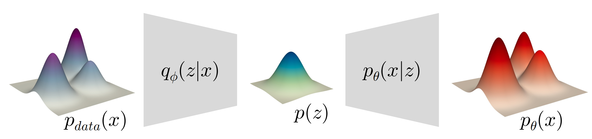

这一节主要介绍VAE

# Variational Autoencoder (VAE)

## Latent Variable Model

假设真实世界的数据$x$是从latent variable $z$生成的，真实数据$x$服从于一个数据分布$p(x)$，latent variable服从于另一个分布$p(z)$。那么模型需要做的是：学会$p(x)\rightarrow p(z)$这个映射，即$p(x|z)$。

我们加入deep learning的思想，用一个**参数$\theta$表示神经网络中可学习的参数**，那么问题就变成：生成器模型 $p_{\theta(x|z)}$ 如何从$p(z)$这个分布推理出最终的 $p_\theta(x)$ 。

为了衡量预测的结果分布 $p_{\theta(x)}$ 的质量（说白了就是构建与真实结果分布 $p{_\text{data}(x)}$ 的损失函数），我们引入KL散度，把损失函数先定义为最小化预测的分布和真实分布的距离：$\mathcal{L}=\min_{\theta}\mathcal{D}_{KL}(p_{\text{data}}(x)||p_{\theta}(x))$。

然后接下来的过程比较数学：

1. 先说明**最小化预测的分布和真实分布的距离**等价于**最大化似然函数**$\max_{\theta}\mathbf{E}_{x\sim p_{\text{data}}}\log{p_{\theta}}(x)$。我们最终需要确定的参数$\theta$的值为：$\theta^{*}=\arg\min_{\theta}\mathcal{D}_{KL}(p_{\text{data}}(x)||p_{\theta}(x))$。

   根据KL散度的定义，我们可以得到：
   $$
   \theta^{*}=\arg\min_{\theta}\sum_x p_{\text{data}}(x)\log(\frac{p_{\text{data}}(x)}{p_{\theta}(x)})
   $$

   由于真实分布$p_\text{data}(x)$已知，可以看成常数，我们把log函数展开得到思路等价的表达：
   $$
   \theta^{*}=\arg\min_{\theta}\sum_x -p_{\text{data}}(x)\log p_{\theta}(x)+\text{const}
   $$

   即：
   $$
   \theta^{*}=\arg\max_{\theta}\sum_x p_{\text{data}}(x)\log p_{\theta}(x)
   $$

   由期望的定义得：$\theta^{*}=\arg\max_{\theta} \mathbf{E}_{x\sim p_{\text{data}}}\log p_{\theta}(x)$
   
2. 接下来，我们对$\log p_\theta(x)$进行衡量，$p_\theta(x)$可以根据条件概率公式得到：
   $$
   p_\theta(x)=\int_z p_\theta(x|z)p(z)dz
   $$
   而在上面的表达式中，需要进行求解的参数 $\theta$ 与 latent variable 所服从的分布 $p(z)$ 都是不知道的。我们进而引入一个"可控的"分布 $q(z)$ 对 $p(z)$ 进行控制：

   这是一个数学游戏，我们先对 $\log p_\theta(x)$ ，用$q(z)$这个分布进行“等价”重写：
   $$
   \log p_\theta(x)=\int_z q(z)\log p_\theta(x)dz
   $$
   接着利用贝叶斯公式得到：
   $$
   \log p_\theta(x)=\int_z q(z)\log(\frac{p_\theta(x|z)p_\theta(z)}{p_\theta(z|x)})dz
   $$

   再玩一个数学游戏，log 函数的指数乘上 $\frac{q(z)}{q(z)}$ ，展开得到：
   $$
   \log p_\theta(x)=\int_z q(z)(\log p_\theta(x|z)+\log (\frac{p_\theta(x)}{q(z)})+\log (\frac{q(z)}{p_\theta(z|x)}))dz
   $$

   分别根据期望与散度的定义得到：$\log p_\theta(x)=\mathbf{E}_{z\sim q(z)}\log p_\theta(x|z)-\mathcal{D}_{KL}(q(z)||p_\theta(z))+\mathcal{D}_{KL}(q(z)||p_\theta(z|x))$

   <!-- $$
   \log p_\theta(x)=\mathbf{E}_{z\sim q(z)}\log p_\theta(x|z)-\mathcal{D}_{KL}(q(z)||p_\theta(z))+\mathcal{D}_{KL}(q(z)||p_\theta(z|x))
   $$ -->

   到这里我们可以发现，原先未知的 $\log p_\theta(x)$ 函数的表示中，仅有 $\mathcal{D}_{KL}(q(z)||p_\theta(z|x))$  是未知的。

   > 这里还得再看看，为啥这个可控，那个不可控

   我们把上面的式子进行变形，显然可得：
   $$
   \log p_\theta(x)-\mathcal{D}_{KL}(q(z)||p_\theta(z|x))=\mathbf{E}_{z\sim q(z)}\log p_\theta(x|z)-\mathcal{D}_{KL}(q(z)||p_\theta(z))
   $$
   式子中左边均为未知的，右边均为已知的。对于任意的分布$q(z)$，由于KL散度具有非负性，我们可以得到 $\log p_\theta(x)$ 函数的下界为 $\mathbf{E}_{z\sim q(z)}\log p_\theta(x|z)-\mathcal{D}_{KL}(q(z)||p_\theta(z))$。这就是传说中的 **ELBO** ：
   $$
   \log p_\theta(x)\geq \mathbf{E}_{z\sim q(z)}\log p_\theta(x|z)-\mathcal{D}_{KL}(q(z)||p_\theta(z))
   $$

3. 我们接下来对$q(z)$进行操作：把$q(z)$用$\phi$参数化为$q_\phi(z|x)$，并且令 $p_\theta (z)$ 成为 $p(z)$ 的先验。

   > 这里需要理解一下

   我们接下来的目标是使得ELBO最大化，即我们要最小化以下函数：
   $$
   \mathcal{L}_{\theta,\phi}(x)=-\mathbf{E}_{z\sim q(z)}\log p_\theta(x|z)+\mathcal{D}_{KL}(q(z)||p_\theta(z))
   $$
   重写后为：
   $$
   \mathcal{L}_{\theta,\phi}(x)=-\mathbf{E}_{z\sim q_\phi(z|x)}\log p_\theta(x|z)+\mathcal{D}_{KL}(q_\phi(z|x)||p_\theta(z))
   $$
   我们对上面这个式子进行例子解释：假定**一个**已知的样本 $x$，经过encoder编码后的latent variable服从于 $q_\phi(z|x)$，从$q_\phi(z|x)$中采样得到$z$，$z$经过decoder $p_\theta(x|z)$解码后，生成预测的结果 $x'$。

   在这个过程中，从原先的样本$x$生成新的样本$x'$，这个中间存在一个**重建损失**，即$-\mathbf{E}_{z\sim q_\phi(z|x)}\log p_\theta(x|z)$。而在利用$q_\phi(z|x)$这个分布去近似真实的分布$q(z)$的时候，又存在**正则化损失**，即 $\mathcal{D}_{KL}(q_\phi(z|x)||p_\theta(z))$。

   - 对于**重建损失**：我们采用最常见的L2 损失，把decoder $p_\theta(x|z)$建模为高斯分布 $\mathcal{N}(x|x',\sigma_0^2)$。利用负对数似然估计得到：
     $$
     \frac{1}{2\sigma_0^2}||x-x'||^2+\text{const}
     $$

     > 这里还得看

   - 对于**正则化损失**：我们采用高斯先验，令$p(z)$为$\mathcal{N}(z|0,\mathbf{I})$，把$q_\phi(z|x)$建模为高斯分布 $\mathcal{N}(z|\mu,\sigma^2)$。其中$\mu$与$\sigma$通过encoder对样本 $x$ 估计得到，最后计算的是：
     $$
     \mathcal{D}_{KL}(\mathcal{N}(z|\mu,\sigma^2)||\mathcal{N}(z|0,\mathbf{I}))
     $$
     
     > 反向传播的时候，会从标准正态分布中采样出$\epsilon$，结合encoder得到的$\mu$与$\sigma$，进行$z=\mu+\epsilon\sigma$

   我们讨论完了单个样本的情况，那么最终的损失函数应该看成单个样本的损失函数在真实的数据分布上面的期望：
   $$
   \mathcal{L}_{\theta,\phi}=\mathbf{E}_{x\sim p_{\text{data}}(x)}[-\mathbf{E}_{z\sim q_\phi(z|x)}\log p_\theta(x|z)+\mathcal{D}_{KL}(q_\phi(z|x)||p_\theta(z))]
   $$

在inference阶段，我们只需要从标准高斯分布$\mathcal{N}(0,\mathbf{I})$里面采样得到$z$，然后通过decoder得到结果。

如上图，encoder把数据的分布映射到latent 的分布，decoder则相反。我们用$q_\phi(z)$近似表示$p(z)$：
$$
q_\phi(z)=\int_x q_\phi(z|x)p_{\text{data}}(x)dx
$$

# Relation to Expectation-Maximization (EM)

在VAE的生成器中，有两部分参数：latent 分布的参数 $q$ 与 生成器神经网络参数 $\theta$。

VAE用神经网络建模$\theta$，用stochastic gradient decent更新参数；EM则经常去分析$q$，用坐标下降更新参数。

我们在VAE中，把ELBO写为：
$$
\text{ELBO}=\mathbf{E}_{x\sim p_{\text{data}}(x)}[\mathbf{E}_{z\sim q_\phi(z|x)}\log p_\theta(x|z)-\mathcal{D}_{KL}(q_\phi(z|x)||p_\theta(z))]
$$
EM则把这个问题用坐标下降法看成max-max procedure，目标为：
$$
\max_{\theta,q}(\text{ELBO}(\theta,q(\cdot)))
$$
在E-step，针对$q$进行优化：
$$
q^{(t)}=p_{\theta^{(t)}}(z|x)
$$
$q$可以使用Gaussian Mixtures或者K-means。

在M-step则对$\theta$进行优化：
$$
\theta^{(t+1)}=\arg\max_{\theta}Q(\theta|\theta^{(t)})
$$
其中M-step的优化目标函数为：
$$
Q(\theta|\theta^{(t)})=\mathbf{E}_{p_{\text{data}}(x)}\mathbf{E}_{p_{\theta^{(t)}}(z|x)}\log p_\theta(x, z)
$$

## K-means AutoEncoder?

可以用autoencoder的思想来看这个问题：

- encoder：把每个样本$x$编码为独热码
- decoder：把每个独热码解码为新的中心点$x'$

目标函数为：
$$
\min\sum_x||x-\text{Decode}(\text{Encode(x)})||^2
$$

# Vector Quantized VAE (VQ-VAE)

和之前的VAE相比最大的不同：之前的VAE的latent variable是连续的，VQ-VAE的**latent variable是离散的**。

VQ-VAE主要用于建模多模态的分布。

> 补充知识：
>
> KL散度：https://zhuanlan.zhihu.com/p/438129018
>
> 变分推断中的ELBO：https://blog.csdn.net/qy20115549/article/details/93074519
>
> EM算法：https://blog.csdn.net/v_JULY_v/article/details/81708386；https://blog.csdn.net/jgj123321/article/details/91868854